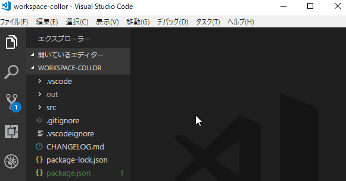

# Workspace Color

## Features

## Installation

[Download vsix](https://github.com/saitofjp/vscode-workspace-collor/releases)

[Offline Install](https://stackoverflow.com/questions/37071388/how-to-install-vscode-extensions-offline/38866913)

## Extension Settings

Todo

Include if your extension adds any VS Code settings through the `contributes.configuration` extension point.

For example:

This extension contributes the following settings:

* `myExtension.enable`: enable/disable this extension
* `myExtension.thing`: set to `blah` to do something

## Known Issues

Calling out known issues can help limit users opening duplicate issues against your extension.

## [Release Notes](CHANGELOG.md)